# dotnet10_nxui_study1

## 概要
* .NET 10 で追加されるファイルベースアプリで NXUI を試す

NXUI (next-gen UI)  
https://github.com/wieslawsoltes/NXUI  

## 詳細

### 実行方法
```sh
dotnet ex1.cs
```

### ビルド方法
```sh
dotnet publish ex1.cs -o ./bin/ex1
```
Windows
```
./bin/ex1/ex1.exe
```
Linux
```
./bin/ex1/ex1
```

### ex1
公式サンプルまま

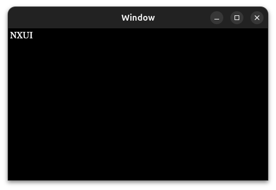

### ex2
ほぼ公式サンプルのカウンター

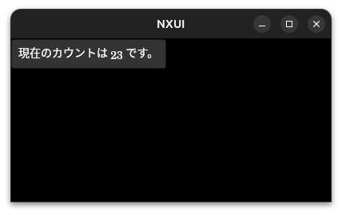

### ex3
カウンターの値保持に BehaviorSubject を使ったサンプル

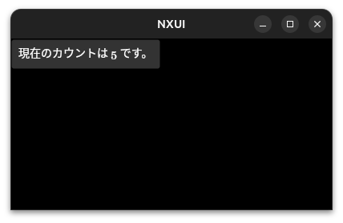

### ex4
カウンターの値保持に BehaviorSubject + State を使ったサンプル
※ボタン中央寄せ

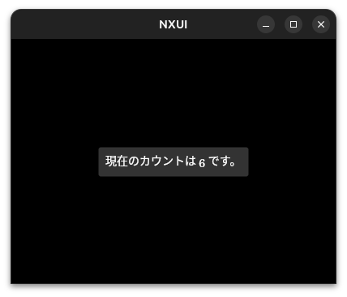

### ex5
ex4 にカウントダウン追加

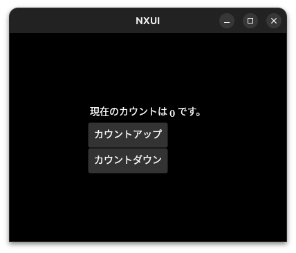

### ex6
【NXUI】C#でワンライナー・クロスプラットホームデスクトップアプリ【AvaloniaUI】
https://zenn.dev/inuinu/articles/528550aab764e8

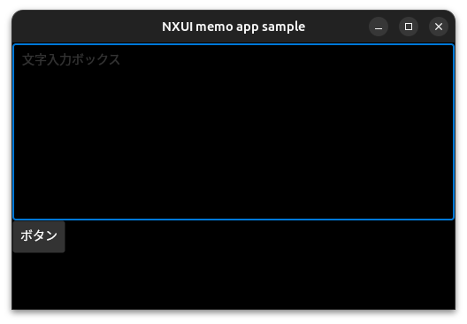

### ex7
ex6 を BehaviorSubject + State に変えたり少しアレンジ

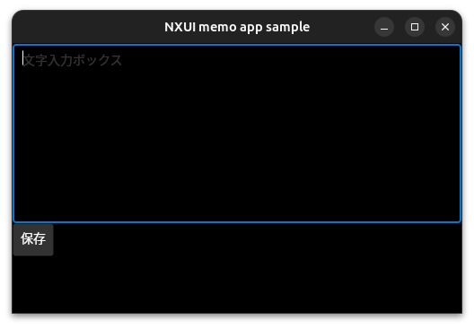

### ex8
入力チェック

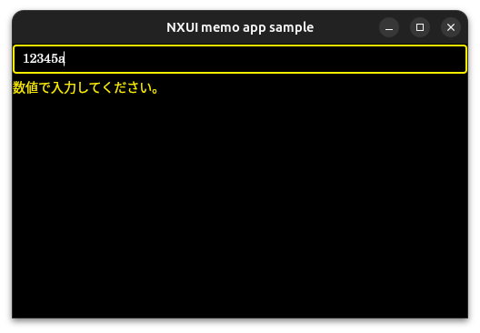

### ex9
同じ値を参照するコントロールの連動の確認

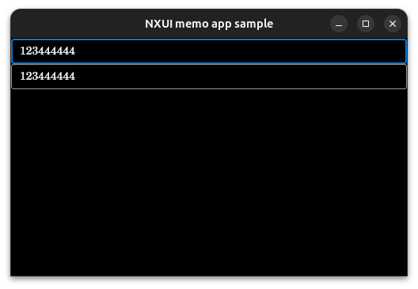

### ex10
MessageBox.Avalonia を試す

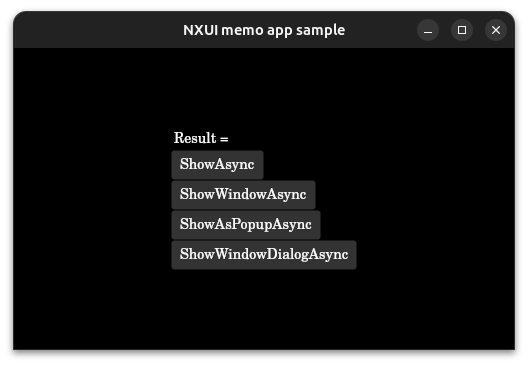  
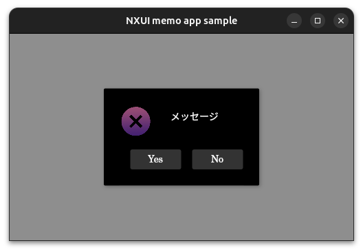

### ex11, ex12
DialogHost.Avalonia を試す  
※ex12 はメソッドチェーンで書いてみたやつ

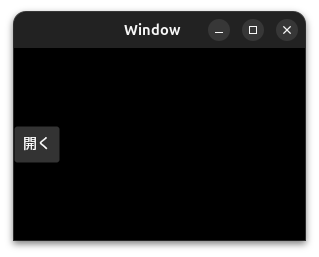  
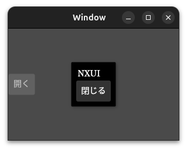

